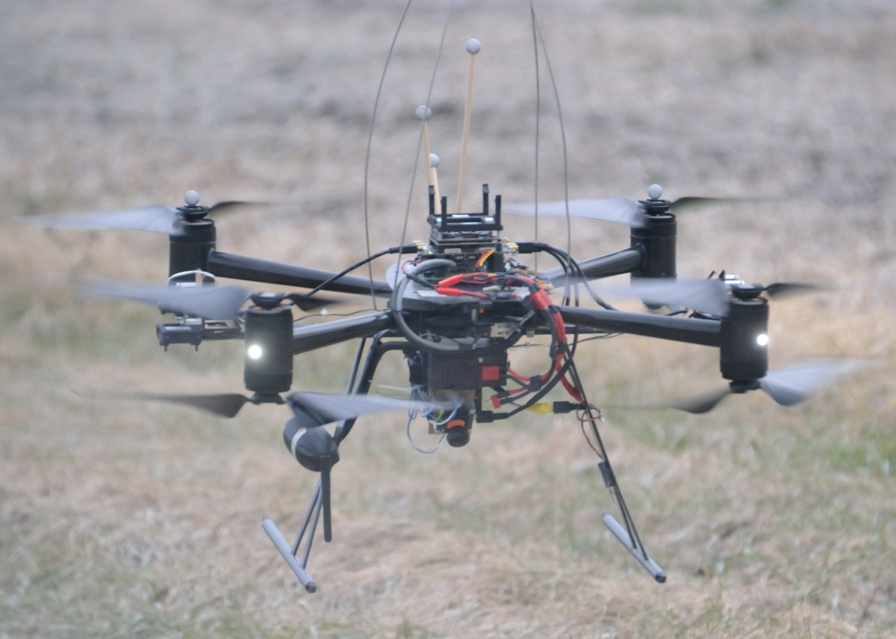
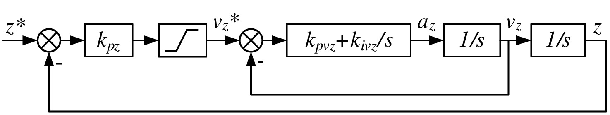
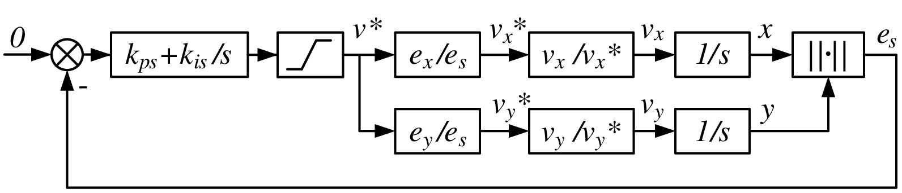
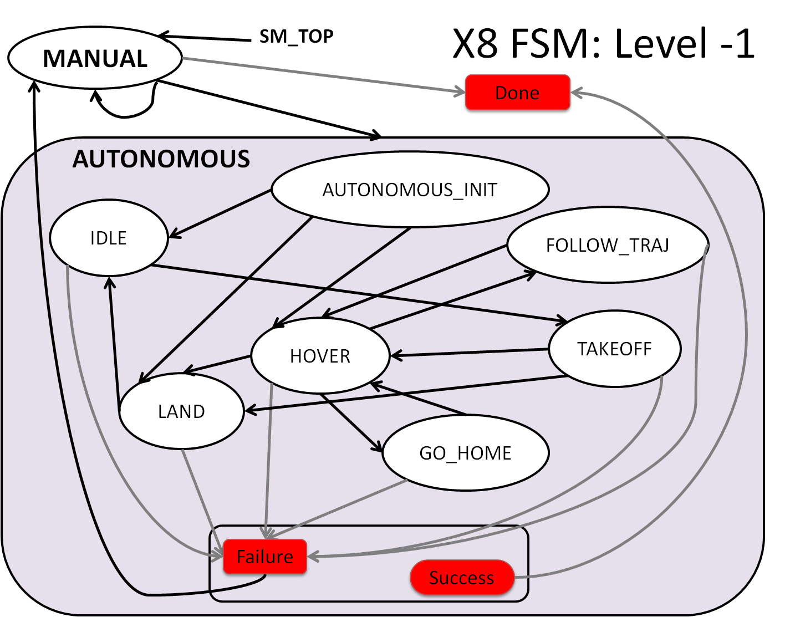

# Introduction
This package provides a flight control and task management system for 
a quadrotor. It enables stable hovering, take-off, landing, path-following, 
and anti-wind manoeuvres. This system was extensively tested in a variety of indoor and outdoor
environment using a Dragangly X8 quadrotor.

**Figure 1:** Draganfly X8 quadrotor in flight

## Motion Controller
The motion controller for the quadrotor consists of cascaded PID loops,
and it comprises an altitude controller and a position
controller, which respectively provide height and horizontal
position regulation.

**Figure 2:** Altitude control loop

**Figure 3:** Position control loop

## Task Management based on Finite Statement Machine
A finite state machine (FSM) is implemented for task
management of the quadrotor. The FSM monitors the 
vehicle’s states, mission status, and operator commands and 
switches the vehicle’s flight modes
accordingly.

**Figure 4:** Task Management based on FSM

# Running the flight controller & task manager with Gazebo & ROS

## Start ROS
`roscore`

## Recalibrate the joystick
`./quadrotor_input/calibration/sim_stick.cal`

## Start ROSGui
`rqt`

## Start SMACH Viewer
`rosrun smach_viewer smach_viewer.py1`

## Start Gazebo
`roslaunch gazebo_quadrotor_worlds x8.launch` 

## Start the scenario
`roslaunch quadrotor_input autopilot_scenario_position_x8.launch`

[//]: # (Scenarios to be tested on the Gazebo prior to experimental flight:)

[//]: # (Manual --> Autopilot)

[//]: # ()
[//]: # (	MissionGo = True)

[//]: # (		At Home)

[//]: # (			Ground level)

[//]: # (			Intermediate level)

[//]: # (			High Altitude)

[//]: # (		Away from Home)

[//]: # (			Ground level)

[//]: # (			Intermediate level)

[//]: # (			High Altitude)

[//]: # (	MissionGo = False)

[//]: # (		At Home)

[//]: # (			Ground level)

[//]: # (			Intermediate level)

[//]: # (			High Altitude)

[//]: # (		Away from Home)

[//]: # (			Ground level)

[//]: # (			Intermediate level)

[//]: # (			High Altitude)

[//]: # ()
[//]: # (Autopilot --> Manual)

[//]: # ()
[//]: # (	MissionGo = irrelevant)

[//]: # (		At Home)

[//]: # (			Ground level)

[//]: # (			Intermediate level)

[//]: # (			High Altitude)

[//]: # (		Away from Home)

[//]: # (			Ground level)

[//]: # (			Intermediate level)

[//]: # (			High Altitude)
